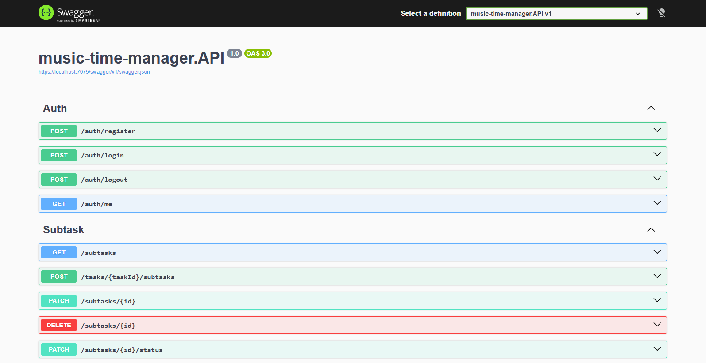

# 🎵 Music Time Manager

A task manager for a small music production team — tasks, subtasks, multiple assignees, and a calendar that reflects reality instead of a background job pretending to.


**[🔗 Live demo](https://music-time-manager-1.onrender.com/)** — currently Russian-only, English UI is on the roadmap.

## 📋 Table of Contents

- [Overview](#-overview)
- [Features](#-features)
- [Tech Stack](#-tech-stack)
- [Project Structure](#-project-structure)
- [Getting Started](#-getting-started)
- [API Documentation](#-api-documentation)
- [Documentation](#-documentation)
- [Roadmap](#-roadmap)

## 🔍 Overview

A private task manager for a 2–10 person team. `Task` is the primary entity — not `Project`, a deliberate scope decision for v1. Tasks split into subtasks, and both support multiple assignees through proper many-to-many relations.

Every non-obvious design decision — including the ones that got reversed mid-project after more thought — is written down in `/docs` before the code, not reverse-engineered from it afterward.

## ✨ Features

### 🏗️ Architecture
- Clean, layered architecture: `Core` (domain models, invariants, Result pattern) → `Application` (services, orchestration) → `Persistence` (EF Core, repositories, migrations) → `Infrastructure` (JWT, hashing) → `API` (controllers, DTOs)
- Domain entities kept separate from EF Core entities — `Core` knows nothing about the ORM
- Result pattern for expected failures instead of exceptions; a global `IExceptionHandler` for the rest

### 🔐 Authentication & Security
- JWT stored in an `HttpOnly`, `Secure`, `SameSite` cookie — never exposed to client-side JS
- Rate limiting with a clear split between "not logged in" (401) and "slow down" (429) — the second one never touches the session

### ✅ Domain Design
- Overdue status is computed on every read (`dueDate < now && status != Done`), never stored — no background job to keep in sync
- Statistics (completed/missed) are aggregate queries, not counter columns — nothing to desync
- Recreating a missed task creates a new row linked back to the original via a self-referencing FK — history stays untouched
- Errors carry a stable code (`Task.DoesNotExist`, `User.UsernameAlreadyUsed`, ...) alongside the message, so the frontend can localize without parsing English text

### 🖥️ Frontend
- Tasks, subtasks, and team workload views backed entirely by the API — no mock data
- Light/dark theme with system-preference detection and manual override
- Responsive, mobile-first layout

## 🧰 Tech Stack

| Layer | Technology |
|---|---|
| API | ASP.NET Core (.NET 10) |
| Database | PostgreSQL via Npgsql / EF Core |
| Auth | JWT (cookie-based) |
| Frontend | React, TypeScript, Vite |
| Data fetching | TanStack Query, Axios |
| Styling | Tailwind CSS, Framer Motion |
| Local dev | Docker Compose |
| Hosting | Render (API + frontend), Neon (Postgres) |

## 📁 Project Structure

```
backend/
├── music-time-manager.API              # Controllers, DTOs, composition root
├── music-time-manager.Application      # Services, orchestration
├── music-time-manager.Core             # Domain models, invariants, errors
├── music-time-manager.Infrastructure   # JWT, password hashing
└── music-time-manager.Persistence      # EF Core, repositories, migrations

frontend/
└── src/                                 # React app (Vite), API hooks, cookie-based auth client

docs/
├── en/                                  # Requirements, DB design, API design
└── ru/                                  # Same, in Russian
```

## 🚀 Getting Started

**Prerequisites**
- [.NET 10 SDK](https://dotnet.microsoft.com/download)
- [Node.js](https://nodejs.org/) + npm
- Docker (for local PostgreSQL)

**Setup**
1. Clone the repository
2. Start PostgreSQL: `docker compose up -d`
3. Copy `appsettings.Development.json.example` → `appsettings.Development.json` and fill in your connection string and JWT secret
4. Run the API:
   ```
   cd backend/music-time-manager.API
   dotnet ef database update -p ../music-time-manager.Persistence -s .
   dotnet run
   ```
5. Run the frontend:
   ```
   cd frontend
   npm install
   npm run dev
   ```

## 📖 API Documentation

Swagger UI is available automatically in the Development environment at `/swagger` once the API is running.



## 📚 Documentation

| Doc | Covers |
|---|---|
| [`01-requirements.md`](docs/en/01-requirements.md) | Functional requirements, user flows, business rules |
| [`02-database-design.md`](docs/en/02-database-design.md) | ER diagram, schema, and *why* each design choice was made |
| [`03-api-design.md`](docs/en/03-api-design.md) | REST contract, DTOs, conventions, status codes |

Documentation in Russian language is available [here](docs/ru).

## 🗺️ Roadmap

- [ ] English UI
- [ ] Telegram bot notifications for due/overdue tasks
- [ ] Structured logging with Serilog
- [ ] Automated tests
