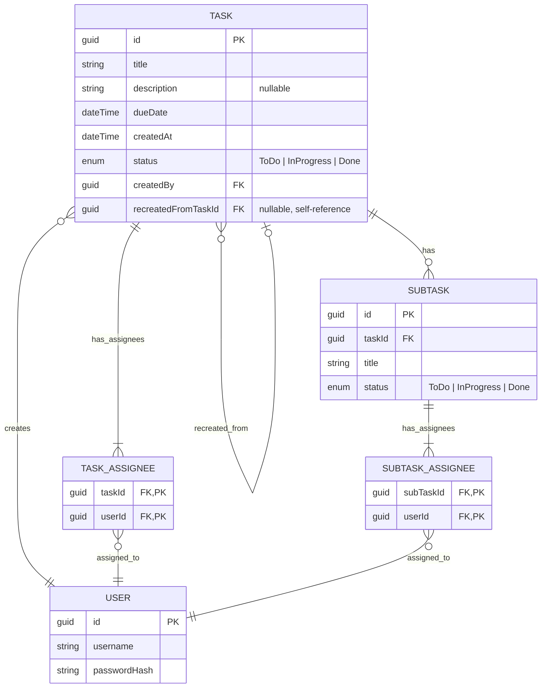

# 📋 02 — Database Design

## Entities

- **User** — пользователь системы. Аутентификация простая (логин/пароль), храним только `username` и `passwordHash`. Ролей не предусмотрено.
- **Task** — задание, создаваемое пользователем. `User` может создать много заданий. Имеет название, описание (необязательно), конечный срок, статус, дату создания и пользователя-создателя. Содержит ноль или несколько `Subtask`. Может ссылаться на другую задачу как на источник пересоздания (`recreatedFromTaskId`).
- **Subtask** — подзадание, имеет название и статус. Принадлежит ровно одной `Task`. Собственного `dueDate` не имеет — срочность наследуется от родительской `Task`.

### Junction-Tables

- **Task_Assignee** — связывает `Task` и `User`, многие-ко-многим.
- **Subtask_Assignee** — то же для `Subtask`.

## ER Diagram

### Легенда кардинальности (Crow's Foot notation)

| Слева | Справа | Значение |
|---|---|---|
| `\|o` | `o\|` | Zero or one |
| `\|\|` | `\|\|` | Exactly one |
| `}o` | `o{` | Zero or more (без верхнего предела) |
| `}\|` | `\|{` | One or more (без верхнего предела) |

Например, `TASK ||--|{ TASK_ASSIGNEE` читается: у одной `Task` — от одной до многих связей в `TASK_ASSIGNEE` (задача не может существовать без единого assignee — отсюда `|{`, а не `o{`), а у каждой записи `TASK_ASSIGNEE` — ровно одна `Task` (`||`).

## Design Decisions

- **Задание и подзадание могут быть созданы без исполнителей** (`POST /tasks`, `POST /tasks/{taskId}/subtasks` не требуют `assigneeIds`) — это осознанное решение: создание задачи и назначение исполнителей на фронте разделены на два последовательных запроса, чтобы `TaskId`/`SubtaskId` существовал до того, как создаются junction-записи. Инвариант "минимум 1 исполнитель" применяется не к моменту создания, а к моменту **удаления**: как только у задачи/подзадачи назначен хотя бы один исполнитель, опустошить список полностью через удаление нельзя. FK не умеет проверить это ни в одном из двух случаев ("минимум 1" в принципе, и "нельзя опустошить, если уже есть") — оба варианта проверяются в Service-слое, при обработке `PUT /tasks/{id}/assignees` (`MinLength(1)` на теле запроса блокирует отправку пустого списка).
- Junction-таблицы имеют составной PK (`taskId + userId` / `subTaskId + userId`), суррогатный `id` не нужен.
- `Subtask` намеренно не имеет `createdBy` — в проекте нет ограничения "редактирует только создатель" (см. `01-requirements.md`, раздел 5), поле не несёт функциональной нагрузки.
- **`status` хранит только 3 значения: `ToDo | InProgress | Done`.** `Overdue` **не хранится** — вычисляется на чтении: `dueDate < UtcNow AND status != Done` (у Subtask — по `dueDate` родительской `Task`).
  - Рассматривался вариант с 4-м хранимым значением + периодическая `IHostedService`-джоба, переводящая задачи в `Overdue`. Отклонён: даёт временное рассогласование БД с реальностью между тиками джобы, требует отдельно реализовывать обратный переход при переносе `dueDate`, и не даёт ничего, что не даёт вычисление на лету — лишняя сложность без выгоды на этом масштабе данных (команда 2-10 человек).
  - `enum TaskStatus` — маппится в БД как `string` через `.HasConversion<string>()` в EF Core (не default `int`) — ради читаемости при отладке через SQL-клиент, цена пренебрежимо мала на этом объёме данных.
- **`Task.recreatedFromTaskId`** — nullable self-referencing FK на `Task.Id`, а не булево поле. `recreatedFromTaskId != null` даёт флаг "это пересозданная задача" бесплатно, плюс даёт трассируемость к оригиналу, плюс позволяет проверить одним запросом, не пересоздавали ли уже конкретную просроченную задачу. Оригинальная задача при пересоздании не удаляется и не мутирует — остаётся в архиве как есть.
