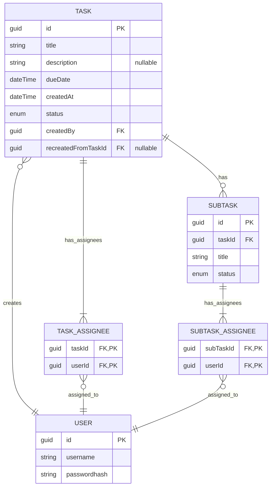

# 02 - Database Design

## Entities 

- User - пользователь системы. Аутентификация простая (логин/пароль), поэтому храним
только username и passwordhash. Ролей пока что не предусмотрено - у всех одинаковые права 
(см. Requirements, раздел 2).

- Task - задание, создаваемое пользователем. User может создать много заданий. Имеет название, описание (необязательно),
конечный срок, статус, дату когда оно было создано и пользователя, которым оно создано. Также содержит ноль или несколько подзаданий Subtask.

- Subtask - подзадание, имеет название и статус. 

### Junction-Tables

Промежуточные таблицы для реализации связи многие ко многим. 

- Task_Assignees - Связывает Task и Users: у одной задачи может быть несколько исполнителей,
а один исполнитель может быть исполнителем нескольких задачь

- Subtask_Assignees - Связывает Subtask и Users: у одной подзадачи может быть несколько исполнителей,
а один исполнитель может быть исполнителем нескольких подзадачь

## ER Diagram

## Design Decisions

- Задание и подзадание имеют как минимум одного исполнителя. Это условие не может быть проверено в БД, поэтому 
должно быть проверено в коде.

- Junction-Tables имеют состовной PK, а не отдельный id. 
