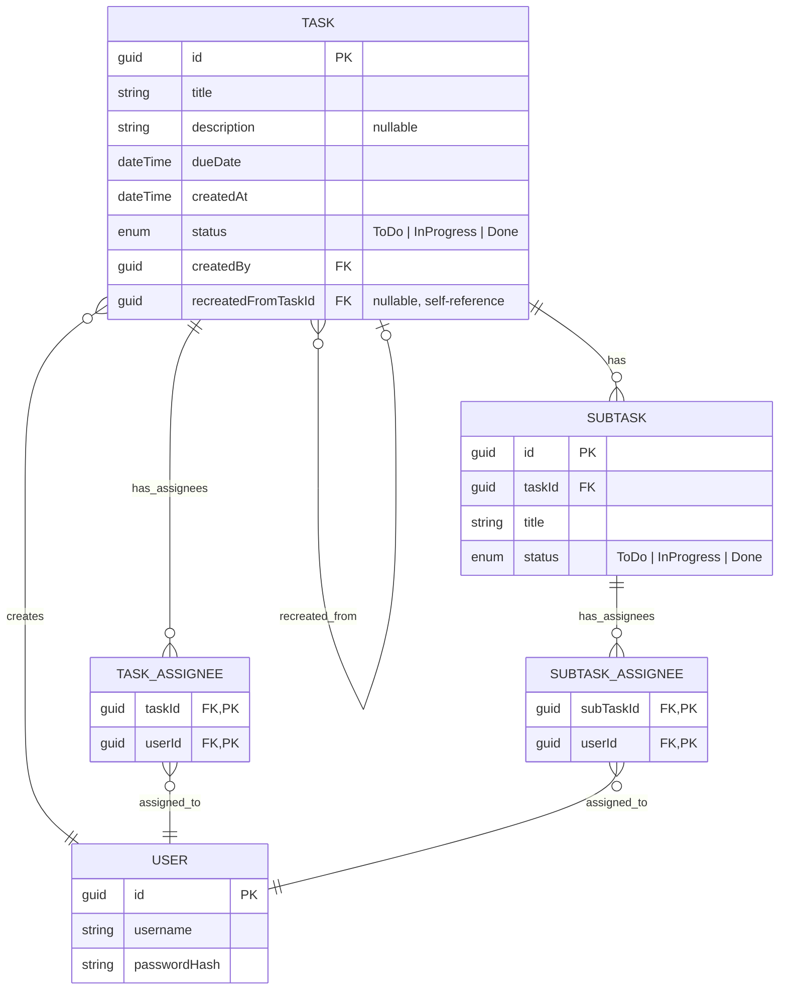

# 📋 02 — Database Design

## Entities

- **User** — a system user. Authentication is simple (login/password), so we only store `username` and `passwordHash`. No roles are planned.
- **Task** — a task created by a user. A `User` can create many tasks. It has a title, an optional description, a due date, a status, a creation date, and the user who created it. It contains zero or more `Subtask`s. It may reference another task as the source it was recreated from (`recreatedFromTaskId`).
- **Subtask** — a subtask, has a title and a status. Belongs to exactly one `Task`. Has no `dueDate` of its own — urgency is inherited from the parent `Task`.

### Junction Tables

- **Task_Assignee** — links `Task` and `User`, many-to-many.
- **Subtask_Assignee** — same, for `Subtask`.

## ER Diagram

### Cardinality Legend (Crow's Foot notation)

| Left | Right | Meaning |
|---|---|---|
| `\|o` | `o\|` | Zero or one |
| `\|\|` | `\|\|` | Exactly one |
| `}o` | `o{` | Zero or more (no upper limit) |
| `}\|` | `\|{` | One or more (no upper limit) |

For example, `TASK ||--o{ TASK_ASSIGNEE` reads: one `Task` has zero to many links in `TASK_ASSIGNEE` (a task can be created with no assignee at all — hence `o{`, not `|{`; see Design Decisions below), and each `TASK_ASSIGNEE` record belongs to exactly one `Task` (`||`).

## Design Decisions

- **A task or subtask can be created with no assignees** (`POST /tasks`, `POST /tasks/{taskId}/subtasks` don't require `assigneeIds`) — this is a deliberate decision: on the frontend, creating a task and assigning users are split into two sequential requests, so that `TaskId`/`SubtaskId` exists before the junction records are created. The "at least 1 assignee" invariant applies not to creation, but to **removal**: once a task/subtask has at least one assignee, the list can't be emptied entirely via removal. FKs can't enforce either case ("at least 1" in principle, and "can't be emptied once non-empty") — both are checked at the Service layer, when handling `PUT /tasks/{id}/assignees` (`MinLength(1)` on the request body blocks submitting an empty list).
- Junction tables have a composite PK (`taskId + userId` / `subTaskId + userId`) — a surrogate `id` isn't needed.
- `Subtask` deliberately has no `createdBy` — the project has no "only the creator can edit" restriction (see `01-requirements.md`, section 5), so the field would carry no functional weight.
- **`status` stores only 3 values: `ToDo | InProgress | Done`.** `Overdue` **is not stored** — it's computed on read: `dueDate < UtcNow AND status != Done` (for Subtask, based on the parent `Task`'s `dueDate`).
  - A version with a 4th stored value plus a periodic `IHostedService` job flipping tasks to `Overdue` was considered. Rejected: it introduces a temporary mismatch between the DB and reality between job ticks, requires separately implementing the reverse transition when `dueDate` is moved, and gives nothing that computing on the fly doesn't already give — unnecessary complexity with no payoff at this data scale (a team of 2-10 people).
  - `enum TaskStatus` is mapped to the DB as a `string` via `.HasConversion<string>()` in EF Core (not the default `int`) — for readability when debugging through a SQL client; the cost is negligible at this data volume.
- **`Task.recreatedFromTaskId`** — a nullable self-referencing FK to `Task.Id`, rather than a boolean field. `recreatedFromTaskId != null` gives the "this task is a recreation" flag for free, plus gives traceability back to the original, plus lets you check with a single query whether a given overdue task has already been recreated. The original task is not deleted or mutated on recreation — it stays in the archive as-is.
